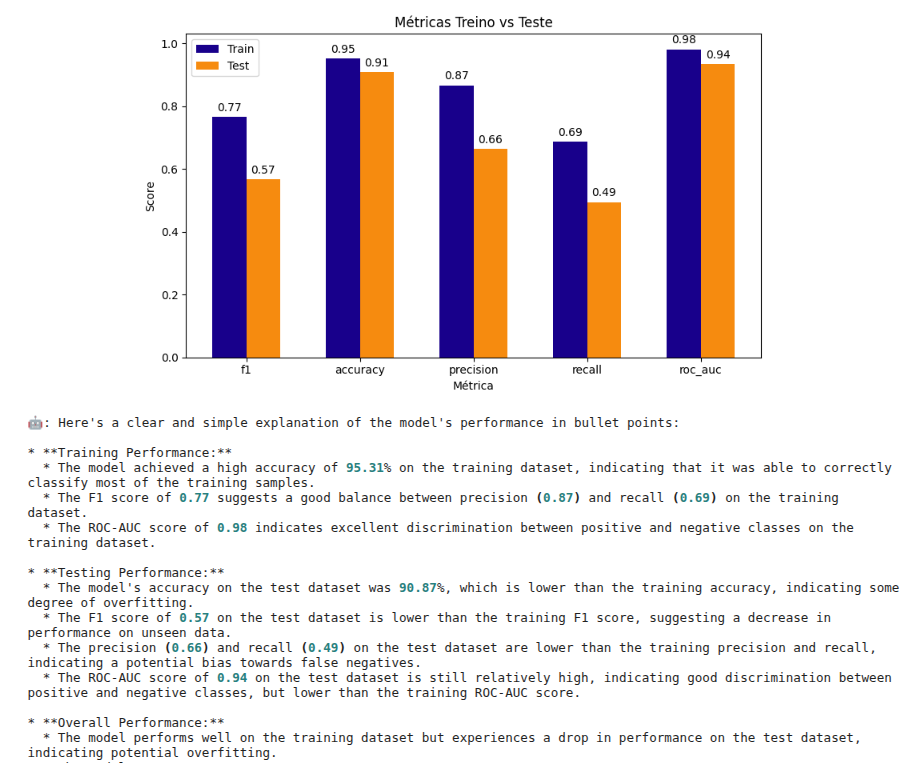
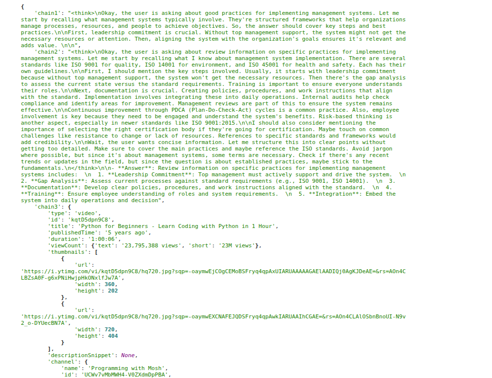
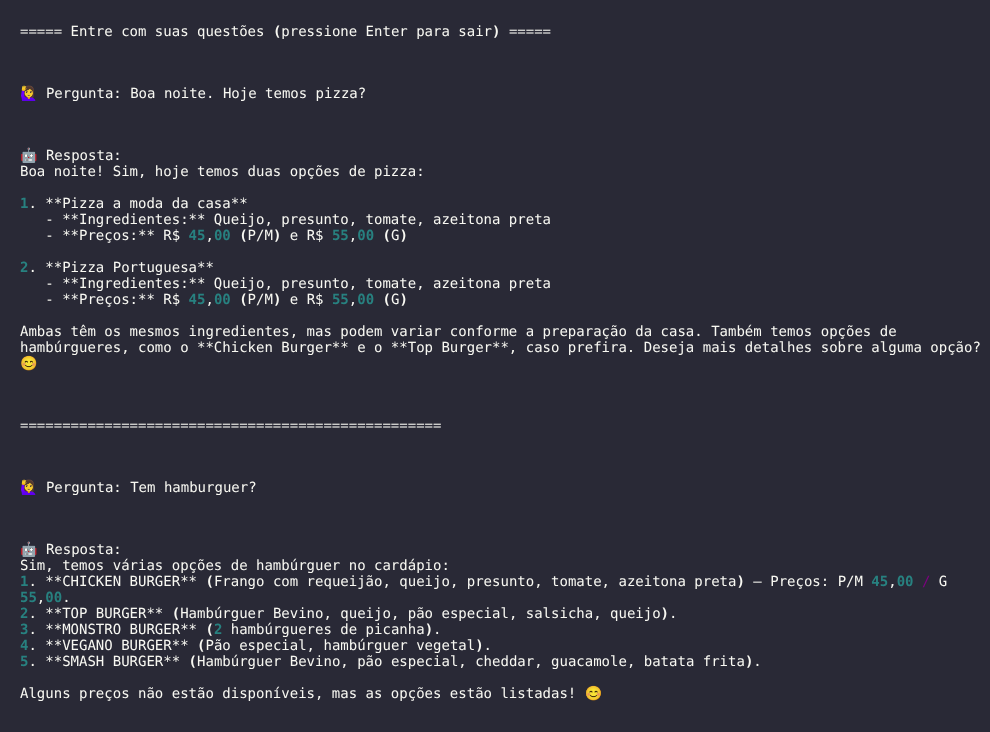

# Labs

## Modelagem com auto ML e LLM para predição de sucesso em campanha de telemarketing

- **Objetivo:** Classificar se um cliente irá (ou não) realizar um depósito, levando em conta informações de campanhas de marketing via telefone.

- **Conteúdo:**

  - Uso de auto ML para análise exploratória (EDA) e treinamento de modelos de machine learning.
  
  - Análise de correlação de features; geração de gráficos e visualizações para EDA.
  
  - Geração de relatórios automatizados em html, contendo informações sobre a qualidade do dataset de treino.

  - Cálculo de métricas de performance para o modelo ótimo.

  - Uso de LLM para explicar os resultados obtidos.
  
- **Dataset:** [Bank Marketing (UCI)](https://archive.ics.uci.edu/dataset/222/bank+marketing)

- **Notebook:**
  - [pred_telemarketing_product_acquisition_success](pred_telemarketing_success/pred_telemarketing_product_acquisition_success.ipynb)
  

 

## Multi-agentes de IA para análises de revisões de papers

A partir de uma [base de reviews de artigos (UCI)](https://archive.ics.uci.edu/dataset/410/paper+reviews) e Langchain, criamos uma chain com três agentes para analisar questões sobre um tema escolhidos por um usuário. A partir deste input, o mini sistema de multi-agentes busca esclarecer a questão/tópico questionado: um deles responde as questões de forma generalista; outro busca responder usando o contexto do dataset disponibilizado (RAG); e outro realiza uma busca por vídeos no Youtube sobre o tema de interesse para complementar a resposta.

- **Conteúdo:**

  - Criação de vector store (FAISS) a partir de embbedings calculados com modelo disponibilizado na Hugging Face.

  - Buscas por similaridade e prompts com retrievers.

  - Testes com elementos do Langchain: prompt template, tools, retrievers, chains e runnable parallel.
  
  - Implementação de multi-agentes com tools e RAG.

- **Notebooks:**

  -  [prepare_data](./analyse_reviews_multi_agents/01.prepare-data.ipynb)

  -  [create-paper-review-agent](./analyse_reviews_multi_agents/02.create-paper-review-agent.ipynb)

 

## RAG local para sessão de perguntas e resposta sobre o cardápio de hoje

Neste lab testamos a extração de conteúdo de texto via OCR de uma imagem de cardápio, o parsing com LLM de textos extraído do OCR e criação de uma RAG simples para responder questões sobre o cardápio fornecido.

- **Conteúdo:**
  
  - Usa OCR (Tesseract) para extrair informações de um cardápio na forma de imagem (PNG).
  
  - Realiza o parsing das informações extraídas usando uma LLM.
  
  - Exporta as informações estruturadas com CSV e JSON.

  - Gera embedding a partir de informações estruturadas da imagem do cardápio, usando modelo disponibilizado pela Hugging Face.

  - Cria banco vetorial (FAISS) e realiza buscas semânticas.

  - Realiza sessão de perguntas e respostas sobre o cardápio fornecido.

- **Notebooks:**

    -  [read_menu](./local_rag_qa_menu/01.read_menu.ipynb)

    -  [rag_qa_menu](./local_rag_qa_menu/02.rag_qa_menu.ipynb)

 