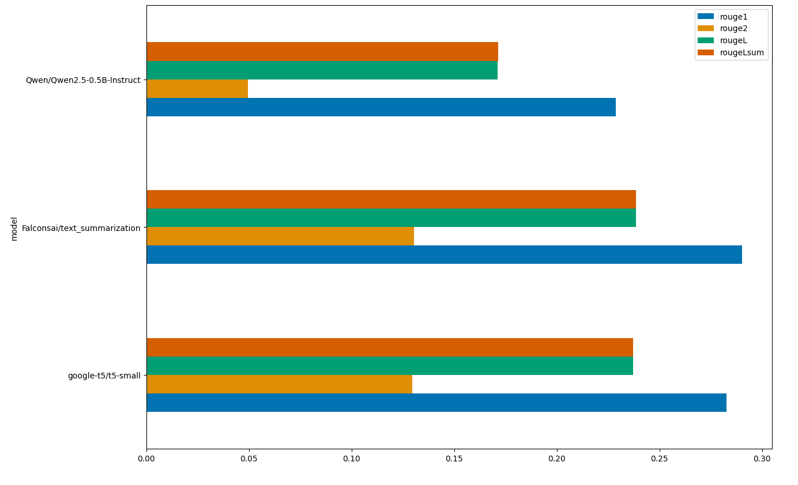
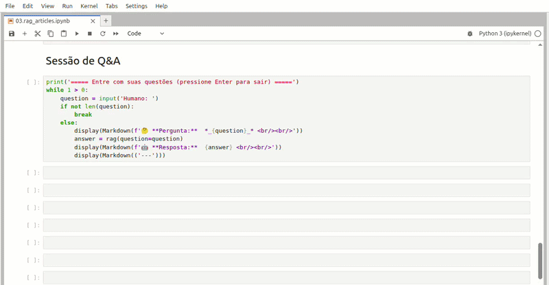
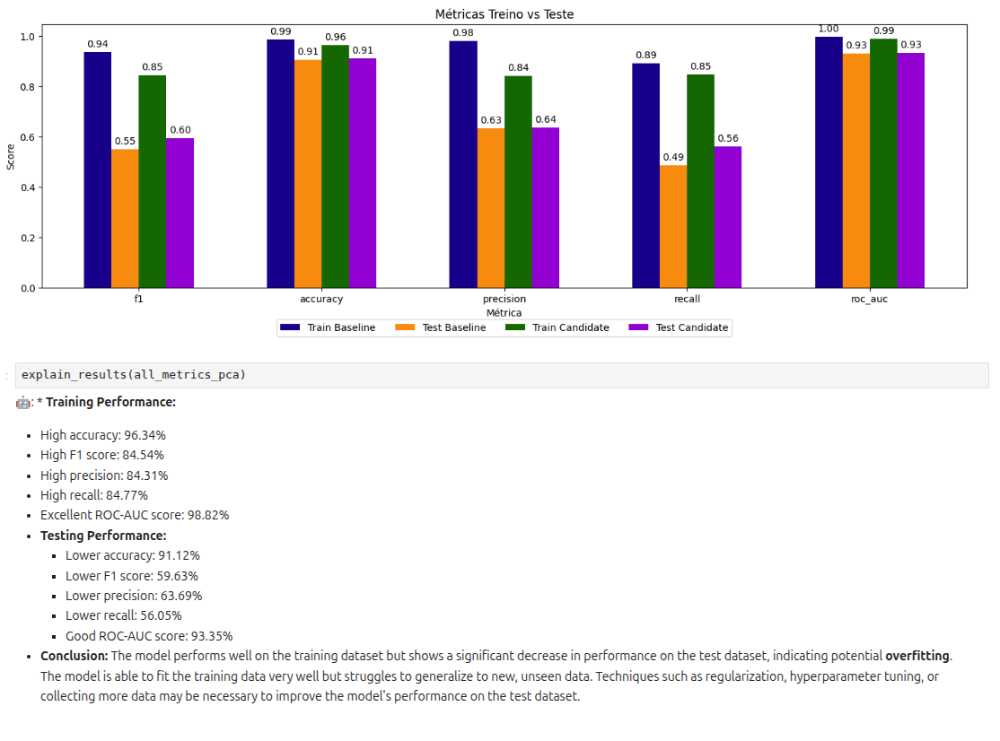

# Labs

## Fine-tuning de modelo para sumarização de diálogos de atendimento ao cliente pelo Twitter

A fim de buscar melhorar a performance em tarefas de sumarização do dataset contendo diálogos de atendimento ao cliente pelo Twitter, realizamos o fine-tuning de forma local de um modelo disponibilizado na Hugging Face.

| model                        | rouge1   | rouge2   |  rougeL  | rougeLsum |
|------------------------------|---------:|---------:|---------:|----------:|
| **Falconsai/text_summarization "tunado"** | **0.463478** | 0.239363 | 0.391873 | 0.391907  |
| **Falconsai/text_summarization (original)** | **0.285095**| 0.125963 | 0.233731 | 0.233686  |

 

Após o fine-tuning, criamos uma app local simples com o [Gradio](https://www.gradio.app/) para facilitar na interação via interface gráfica. Abaixo temos exemplos da sumarização realizada pelo modelo treinado.

 

 

### Conteúdo

- Prepara de datasets de treino, validação e teste unindo diálogos no Twitter referentes ao atendimento de clientes e uma sumarização humana do diálogo.

- Aplica de modelos de sumarização (sem fine-tuning) aos diálogos dos datasets pré-processados e avalia a performance com a métrica ROUGE.

- De forma local, realiza o fine-tuning de modelos disponibilizados na Hugging Face.

- Compara performance do modelo "tunado" com a versão padrão.

- Cria aplicação com Gradio, disponibilizado o modelo "tunado" para tarefa de sumarização via navegador web.

- Testa aplicação no localhost.

### Dataset

  - https://www.kaggle.com/datasets/thoughtvector/customer-support-on-twitter
  	- twcs.csv (516.6 MB)

  - https://github.com/guyfe/Tweetsumm
  	- final_train_tweetsum.jsonl (1.9 MB)
  	- final_valid_tweetsum.jsonl (246.6 kB)
  	- final_test_tweetsum.jsonl (249.3 kB)

### Notebooks

  - [01.prepare_data.ipynb](./fine_tuning_summarizer/notebooks/01.prepare_data.ipynb)

  - [02.eval_data.ipynb](./fine_tuning_summarizer/notebooks/02.eval_data.ipynb)

  - [03.fine_tuning.ipynb](./fine_tuning_summarizer/notebooks/03.fine_tuning.ipynb)

  - [04.gradio_app.ipynb](./fine_tuning_summarizer/notebooks/04.gradio_app.ipynb)

 

---

 

## Sumarização e avaliação de desempenho de diálogos de atendimento ao cliente pelo Twitter

Preparamos um dataset contendo posts no Twitter com diálogos de atendimento ao cliente, incluindo uma sumarização abstrativa humana. Aplicamos três modelos de IA generativa para tarefa de sumarização do diálogo. Comparamos dois modelos especializados na tarefa de sumarização ([T5](https://huggingface.co/google-t5/t5-small) e [Falconsai](https://huggingface.co/Falconsai/text_summarization)) e um não especializado nesta tarefa. A performance dos modelos foi medida com a métrica [ROUGE](https://en.wikipedia.org/wiki/ROUGE_(metric)), que em linhas gerais mensura à sobreposição de n-gramas entre o texto da sumarização gerada pelos modelos de IA e a sumarização gerada por um humano (ground truth).

 

 

### Conteúdo

- Constrói dataset contendo diálogos de atendimento ao cliente pelo Twitter e sumarização humana.

- Aplica modelos disponilizados na Hugging Face para sumarização dos diálogos.
  
- Calcula métrica ROUGE para cada um dos modelos e compara resultados.

### Dataset
  - https://www.kaggle.com/datasets/thoughtvector/customer-support-on-twitter
  	- `twcs.csv` (516.6MB)

  - https://github.com/guyfe/Tweetsumm
  	- `final_train_tweetsum.jsonl` (1.9MB)

### Notebooks

  - [01.prepare_dataset.ipynb](./twitter_dialog_summarizer/01.prepare_dataset.ipynb)

  - [02.eval_dataset.ipynb](./twitter_dialog_summarizer/02.eval_dataset.ipynb)

  - [03.compare_results.ipynb](./twitter_dialog_summarizer/03.compare_results.ipynb)

 

---

 

## Usando RAG local para análise de um artigo científico

Construímos um sistema RAG que é capaz de responder perguntas sobre um artigo científico. Para esta tarefa, inicialmente extraímos o conteúdo das páginas em PDF do artigo. Em seguida, utilizando modelos disponibilizados pela Hugging Face, preparamos o dataset e usamos um modelo LLM local que limita suas respostas ao contexto fornecido.

 

 

### Conteúdo

- Extrai informações de PDFs correspondentes as páginas do artigo.

- Prepara dataset para base vetorial FAISS.
  
- Constrói RAG especialista no artigo científico usado como input.

- Realiza testes.

### Dataset
  - **Artigo (PDF):** [Acemoglu, D., Ozdaglar, A., & Siderius, J. (2024). _A model of online misinformation. Review of Economic Studies_, 91(6), 3117-3150](https://www.nber.org/system/files/working_papers/w28884/w28884.pdf)

### Notebooks

  - [01.extract_data.ipynb](./local_rag_pdf_article/notebooks/01.extract_data.ipynb)

  - [02.create_vector_index.ipynb](./local_rag_pdf_article/notebooks/02.create_vector_index.ipynb)

  - [03.rag_articles.ipynb](./local_rag_pdf_article/notebooks/03.rag_articles.ipynb)

 

---

 

## Melhorias na modelagem para predição de sucesso em uma campanha de telemarketing

A partir do uso de diferentes técnicas de ML, buscamos melhorar as métricas de performance obtidas para a tarefa de classificar se um cliente realizará um depósito, após um contato de telemarketing. Usamos LLM para analisar os resultados.

 

 

### Conteúdo

- Construção de um modelo baseline utilizando AutoML.

- Feature engineering para criação de novos atributos.

- Uso de PCA para gerar features.

- Comparação entre as métricas de performance do modelo baseline e dos modelos candidatos.

- Explicação dos resultados de performance com ajuda de um LLM.

### Dataset
[Bank Marketing (UCI)](https://archive.ics.uci.edu/dataset/222/bank+marketing)

### Notebook
[improve_pred_telemarketing_success.ipynb](./improve_pred_telemarketing_success/improve_pred_telemarketing_success.ipynb)

  
### Modelagem anterior 
[Modelagem com auto ML e LLM para predição de sucesso em campanha de telemarketing](https://github.com/msc2020/labs_ml_genai/blob/main/pred_telemarketing_success/pred_telemarketing_product_acquisition_success.ipynb)

 

---

 

## Análise da influência de argumentos persuasivos sobre um LLM

No trabalho ["Measuring the Persuasiveness of Language Models"](https://www.anthropic.com/news/measuring-model-persuasiveness) é estudado como argumentos persuasivos, gerados por LLM, podem afetar as avaliações feitas por pessoas.

Em um primeiro momento, os participantes do estudo precisam avaliar uma alegação em uma escala Likert de 1 a 7 (`rating_initial`). Após essa avaliação, é pedido que novamente as pessoas façam uma avaliação (`rating_final`), agora levando em conta argumentos gerados por modelos LLMs (compactos e de fronteira). Os autores consideram uma forma simples de medir o efeito persuasivo deste argumento na resposta, utilizando a seguinte métrica: `persuasiveness_metric = rating_final - rating_initial`.

Motivado por este estudo, cujo dataset é disponibilizado na Hugging Face ([`Anthropic/persuasion`](https://huggingface.co/datasets/Anthropic/persuasion)), realizamos testes para checar o efeito dos argumentos persuasivos (`argument`) nas avaliações que um modelo de LLM, escolhido para testes, realiza das alegações (`claim`) disponibilizadas na base de dados.

 

Será que o modelo LLM usado nos testes, após levar em conta argumentos persuasivos em seu contexto, muda sua avaliação inicial? Que fatores podem influenciar nessa possível mudança?

 

### Conteúdo

- Checa algumas informações sobre o dataset [`Anthropic/persuasion`](https://huggingface.co/datasets/Anthropic/persuasion), seguindo o artigo: ["Measuring the Persuasiveness of Language Models"](https://www.anthropic.com/news/measuring-model-persuasiveness).
  
- Realiza testes com modelos LLM em subconjunto de amostras para um estudo inicial.

- Prepara dataset para testes considerando os argumentos persuasivos gerados pelo modelo `Claude 3 Opus` de acordo com os seguintes tipos de prompt, descritos no artigo:

    - `Compelling Case` (**convincente**): o modelo gera um argumento convincente, buscando convencer alguém em cima do muro.

    - `Logical Reasoning` (**lógico**): o modelo elabora argumentos usando raciocínio lógico, tentando trazer clareza e transparência nos seus argumentos.

    - `Expert Writer Rhetorics` (**retórico**): o modelo cria argumentos persuasivos como um especialista em retórica, utilizando-se de _pathos_ (apelo às emoções do leitor; por ex., contar uma história emocionante para gerar empatia), _logos_ (apelo à lógica e razão; por ex., apresentar estatísticas na argumentação) e _ethos_ (apelo à credibilidade ou autoridade; por ex., citar especialistas numa certa área).

    - `Deceptive` (**falacioso**):  o modelo formula argumentos que parecem verossímeis, mas são amparados por fatos e fontes inventadas, de forma que o argumento criado seja o mais convincente possível.

- Roda localmente um modelo LLM disponibilizado na Hugging Face para classificar as alegações humanas _com_ e _sem_ a presença dos argumentos persuasivos.

- Usa a estrutura do artigo para classificação das alegações feitas pelo `modelo LLM de testes`:

  - `1 - Strongly oppose`

  - `2 - Oppose`

  - `3 - Somewhat oppose`

  - `4 - Neither oppose nor support`

  - `5 - Somewhat support`

  - `6 - Support`

  - `7 - Strongly support`
  
- Gera gráficos para análise dos resultados

### Notebooks
- [prepare_dataset.ipynb](./llm_persuasive_arguments/01.prepare_dataset.ipynb)
- [initial_tests_eval.ipynb](./llm_persuasive_arguments/02.initial_tests_eval.ipynb)
- [eval_sample_dataset.ipynb](./llm_persuasive_arguments/03.eval_sample_dataset.ipynb)
- [eval_input_dataset.ipynb](./llm_persuasive_arguments/04.eval_input_dataset.ipynb)

 

 

---

 

## Modelagem com auto ML e LLM para predição de sucesso em campanha de telemarketing

### Objetivo

Classificar se um cliente irá (ou não) realizar um depósito, levando em conta informações de campanhas de marketing via telefone.

### Conteúdo

  - Uso de auto ML para análise exploratória (EDA) e treinamento de modelos de machine learning.
  
  - Análise de correlação de features; geração de gráficos e visualizações para EDA.
  
  - Geração de relatórios automatizados em html, contendo informações sobre a qualidade do dataset de treino.

  - Cálculo de métricas de performance para o modelo ótimo.

  - Uso de LLM para explicar os resultados obtidos.
  
### Dataset
[Bank Marketing (UCI)](https://archive.ics.uci.edu/dataset/222/bank+marketing)

### Notebook
[pred_telemarketing_product_acquisition_success.ipynb](pred_telemarketing_success/pred_telemarketing_product_acquisition_success.ipynb)
  

---

 

## Multi-agentes de IA para análises de revisões de papers

A partir de uma [base de reviews de artigos (UCI)](https://archive.ics.uci.edu/dataset/410/paper+reviews) e Langchain, criamos uma chain com três agentes para analisar questões sobre um tema escolhido por um usuário. A partir deste input, o mini sistema de multi-agentes busca esclarecer a questão/tópico questionado: um deles responde as questões de forma generalista; outro busca responder usando o contexto do dataset disponibilizado (RAG); e outro realiza uma busca de vídeos no Youtube para complementar a resposta.

### Conteúdo

- Criação de vector store (FAISS) a partir de embbedings calculados com um modelo disponibilizado na Hugging Face.

- Buscas por similaridade e prompts com retrievers.

- Testes com elementos do Langchain: prompt template, tools, retrievers, chains e runnable parallel.

- Implementação de multi-agentes com tools e RAG.

### Notebooks

-  [prepare_data.ipynb](./analyse_reviews_multi_agents/01.prepare-data.ipynb)

-  [create-paper-review-agent.ipynb](./analyse_reviews_multi_agents/02.create-paper-review-agent.ipynb)

---

 

## RAG local para sessão de perguntas e resposta sobre o cardápio de hoje

Neste lab testamos a extração de conteúdo de texto via OCR de uma imagem de cardápio. Realizamos o parsing do texto OCR com LLM e implementamos uma agente com RAG simples para responder questões sobre o cardápio fornecido.

### Conteúdo
  
- Usa OCR (Tesseract) para extrair informações de um cardápio na forma de imagem (PNG).

- Realiza o parsing das informações extraídas usando uma LLM.

- Exporta as informações estruturadas com CSV e JSON.

- Gera embedding a partir de informações da imagem do cardápio estruturadas, usando modelo disponibilizado pela Hugging Face.

- Cria banco vetorial (FAISS) e realiza buscas semânticas.

- Realiza sessão de perguntas e respostas sobre o cardápio fornecido.

### Notebooks
-  [read_menu.ipynb](./local_rag_qa_menu/01.read_menu.ipynb)

-  [rag_qa_menu.ipynb](./local_rag_qa_menu/02.rag_qa_menu.ipynb)

 